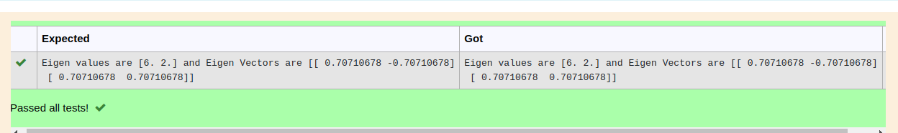

# EIGENVALUES-AND-EIGENVECTORS

## Aim:
To write a python program to find the Eigenvalues and Eigen Vectors

## Equipment’s required:
1. 	Hardware – PCs
2. 	Anaconda – Python 3.7 Installation / Moodle-Code Runner

## Algorithm:

### Step1 : 
import numpy as np

### Step 2: 
type the given values in np.array

### Step 3:
Using the np.linalg.eig(),  we get two results (first is eigenvalue and second is eigenvector) of the given matrix.

### Step 4: 
print and run the program

## Program:
```python
#Program to find the eigen values and eigen vectors.
#Developed by: PRAVEEN D
#RegisterNumber:22005917
import numpy as np
a=np.array([[4,2],[2,4]])
values,vectors=np.linalg.eig(a)
print('Eigen values are {} and Eigen Vectors are {}'.format(values,vectors))
```

## Output:

## Result:
Thus the Eigenvalue and Eigenvector is successfully solved using python program
